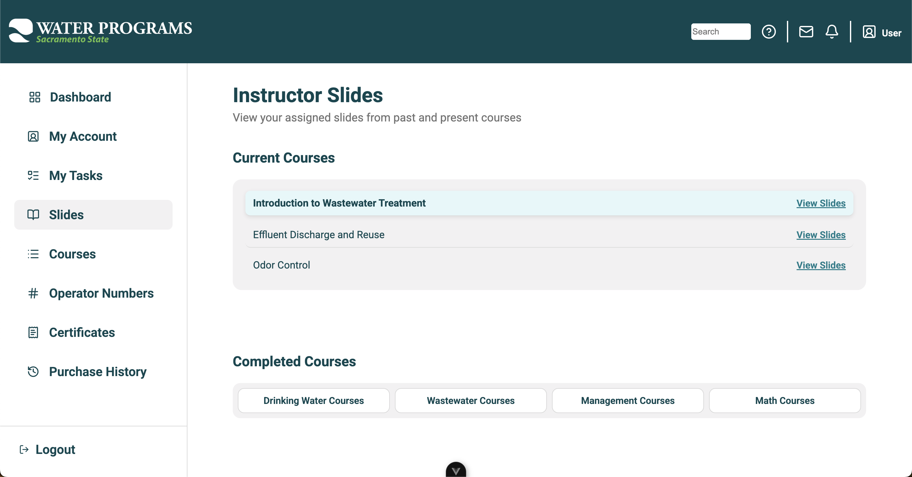
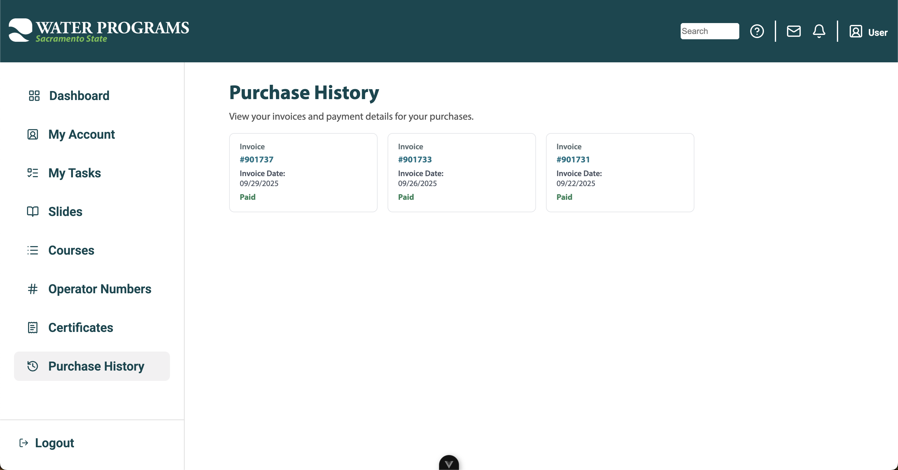

# Office of Water Program's Learning Portal Redesign Project

  

## A fully functional OWP Learning Portal project written in Vue.js that creates a modern, user-friendly student center integrated directly into the official OWP website at California State University of Sacramento!

This colloborative senior project is a industry-grade redesign that provides the OWP website with:

- Personalized dashboard with greetings, course tracking, and certificates
- Streamlines access to certificates, purchase history, account management, and operator number updates
- Uses API-based data retrieval (no direct database access) for security and scalability
- Employs modern web technologies (Vue.js, Tailwind CSS, PHP, SQL) for performance and maintainability

With that in mind our expected outcomes are:​

- Enhanced student experience through intuitive navigation and updated UI
- Improved accessibility to learning materials and certification information
- Seamless integration with OWP’s existing systems
- A sustainable and maintainable platform for future OWP growth
- Personalized Webpages​
- Ease of access​
- Intuitive navigation​

## How the site looks

Dashboard Page

Instructor Slides Page

Purchasde History Page

## How to install the OWP Portal Redesign on your local machine with Git

1. Clone this project
2. Install Node.js - https://nodejs.org/en/download
3. Open a terminal and CD to the 'frontend' folder
4. Run 'npm install' to install core project files
5. Run 'npm run dev' to run the site locally

## Testing

- Checked routing for each "link" element on the page.
- Checked hover, click, and dialog effects worked correctly.
- Ensured each page looked standard to OWP design (font, color scheme, crossreference with design example).

## Deployment - explain how OWP will deploy the app and not usm give cost estimates here 

IDK what to put here. 

## CANVAS INSTRUCTIONS:

Use your JIRA to create a timeline section with key milestones for your project
NOTE: When coming up with the timeline this is the timeline for what you expect to get done in 191 based on the user stories you created in the backlog for all the key features with estimates.

## Known issues (Work in progress)

Scaling for mobile.

## Like this project? - Remove this probably

Insert link to owp learning portal website.

## Authors:
- Kevin Chang
- Ryan Crandall
- Youssef Boujebha
- Nicholas Guzman
- Uday Kyama 
- Cristobel Navarro-Miranda
- Vincent Lam
- Heet Shah
