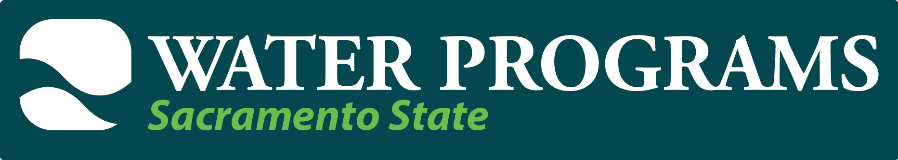
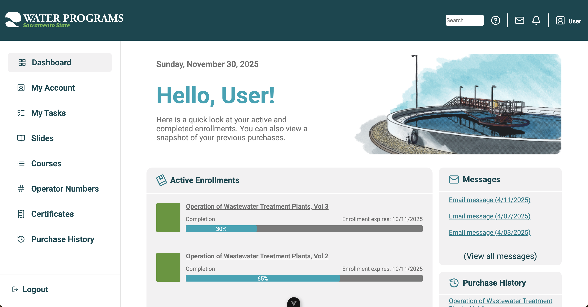
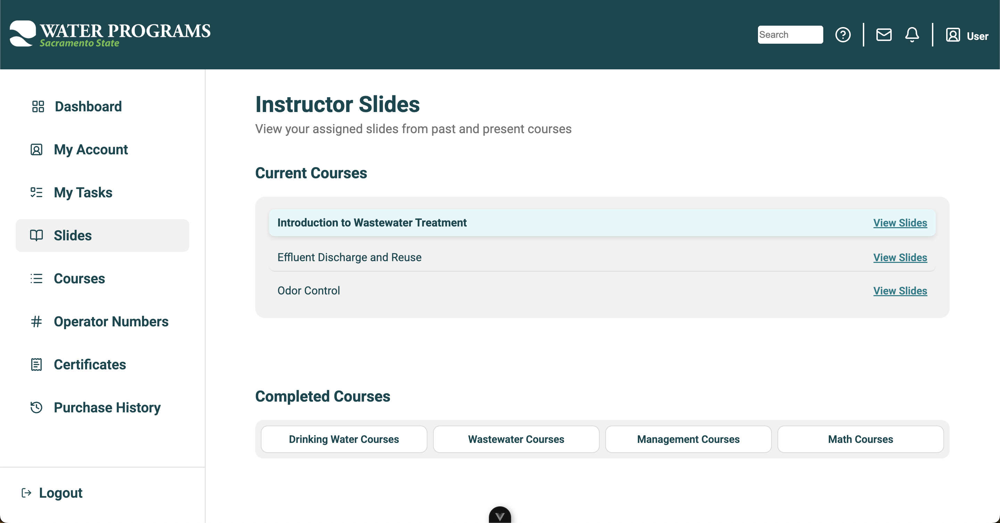
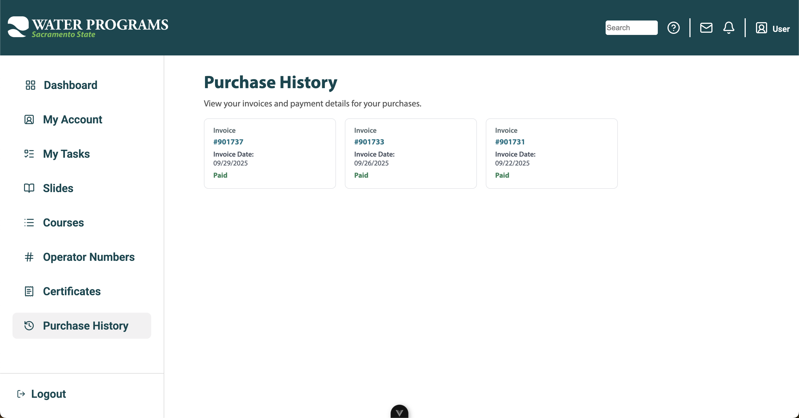

INSERT PROJECT LOGO HERE (UDAY)

# Office of Water Programs Learning Portal Redesign

[](https://vuejs.org/)
[](https://tailwindcss.com/)
[](https://vitejs.dev/)
[](https://playwright.dev/)
[](https://vitest.dev/)
[](https://nodejs.org/en/blog/release/v22.20.0)
[](https://www.npmjs.com/)

## Project Description

The **Office of Water Programs (OWP) Learning Portal Redesign** is a modern, industry-grade web application that provides students and professionals with a centralized platform to access water treatment educational content, track certifications, manage accounts, and monitor course progress. Built as a collaborative senior project at California State University, Sacramento, this redesign transforms OWP's legacy learning portal into an intuitive, user-friendly experience.

## What the Application Does

The OWP Learning Portal provides students with:

- **Personalized Dashboard** - Greeting, course tracking progress ring, and certificate overview
- **Course Management** - Active, completed, and recommended courses with detailed progress tracking
- **Certificate Management** - View and download PDF certificates for completed courses (grade "CR")
- **Purchase History** - Access invoices, payment details, and downloadable receipts
- **Account Management** - Update contact information and manage profile details
- **Operator Numbers** - Track water/wastewater operator certifications across multiple states
- **My Tasks** - View completed, upcoming, and overdue course tasks with progress indicators
- **Messaging System** - Send/receive emails within OWP ecosystem (proof of concept)
- **Slides & Media** - Access instructor slides and course media content

## Why the Application Was Created

The original OWP website presented several challenges for students:
- Disjointed navigation between learning materials, certificates, and account information
- Limited visibility into course progress and completion status
- No centralized location for managing operator certification numbers
- Difficult access to purchase history and receipts

This redesign addresses these pain points by providing:
- **Streamlined access** to all student resources from a single portal
- **Real-time API integration** with OWP's backend systems
- **Modern, responsive UI** following OWP design standards
- **Personalized experience** with user-specific data and recommendations

## Product Screenshots

> **Image Suggestion:** Add screenshots to the `./assets/` folder and reference them below

### Dashboard Page
*The landing page showing active enrollments, messages, and purchase history*



### Instructor Slides Page
*Access course materials and instructor presentations*



### Purchase History Page
*View invoices, download receipts, and track payments*



### Certificates Page
*Download PDF certificates for completed courses*

> **Image Suggestion:** `./assets/certificates.png`

### My Account Page
*Manage contact information and view account summary*

> **Image Suggestion:** `./assets/my-account.png`

### Operator Numbers Page
*Add, edit, or remove operator certification numbers by state*

> **Image Suggestion:** `./assets/operator-numbers.png`

### My Tasks Page
*Track completed, upcoming, and overdue course tasks*

> **Image Suggestion:** `./assets/my-tasks.png`

## Team Silicon Scribes

| Name | Role | Contact |
|------|------|---------|
| Cristobel Navarro-Miranda | Developer | cnavarro-miranda@csus.edu |
| Ryan Crandall | Developer | racrandall@csus.edu |
| Youssef Boujebha | Developer | youssefboujebha@csus.edu |
| Nicholas Guzman | Developer | nguzman2@csus.edu |
| Uday Kyama | Developer | udaykyama@csus.edu |
| Kevin Chang | Developer | kevinchang@csus.edu |
| Vincent Lam | Developer | vlam3@csus.edu |
| Heet Shah | Developer | heetshah@csus.edu |

**Project Owner:** David Stephan Benjamin

## Technology Stack

### Frontend
- **Framework:** Vue.js 3.5.32
- **Build Tool:** Vite 7.3.1
- **Styling:** Tailwind CSS
- **State Management:** Pinia
- **Icons:** Lucide Vue Next
- **PDF Generation:** jsPDF

### Backend Integration
- **API:** PHP-based REST API (OWP infrastructure)
- **Database:** Microsoft SQL Server (OWP-managed)
- **Authentication:** OWP credential system (external)

### Testing
- **Unit/Integration:** Vitest 3.2.4 + Vue Test Utils
- **E2E:** Playwright 1.55.1 (Chromium, Firefox, WebKit)

## Installation & Local Setup

### Prerequisites

| Software | Version | Download Link |
|----------|---------|---------------|
| Node.js | 22.20.0 (LTS) | [nodejs.org](https://nodejs.org/) |
| Git | 2.45.1+ | [git-scm.com](https://git-scm.com/) |
| Visual Studio Code (recommended) | Latest | [code.visualstudio.com](https://code.visualstudio.com/) |

### Quick Start / Running the Application

1. **Clone the repository**
   ```bash
   git clone https://github.com/kevinpchang/OWP-Portal-Redesign.git
   cd OWP-Portal-Redesign
   ```
2. **Navigate to frontend directory**
   ```bash
   cd frontend
   ```
3. **Install Dependencies**
    ```bash
    npm install
    ```
4. **Run Development Server**
    ```bash
    npm run dev
    ```
5. **Open the Application**
  
    Open your browser to the localhost URL displayed in the terminal, typically:
    ```bash
    http://localhost:5173
    ```

## Running Tests

### Navigate to frontend directory
    cd frontend

### Run all unit and integration tests
  ```bash
  npm run test:front
  ```
### Run a specific test file
  ```bash
  npm run test:front -- src/__tests__/<PageName>IntegrationTest.spec.js
  npm run test:front -- src/__tests__/<PageName>UnitTest.spec.js
  ```

### Run all E2E tests using Chromium
  ```bash
  npm run test:e2e
  ```

### Run a specific E2E test
  ```bash
  npx playwright test e2e/<PageName>E2E.spec.js --project=chromium
  ```

  ## Test Artifacts

All test files are located in the GitHub repository:

- **Unit/Integration Tests:** `/frontend/src/__tests__/`
- **E2E Tests:** `/frontend/e2e/`
- **Test Results:** Generated locally in `/test-results/`

## Deployment

### Production Build

To create a production-ready version of the frontend application, run:
```bash
cd frontend
npm run build
```
The production-ready files will be generated in the `/frontend/dist` folder.

### Current Hosting and Long-Term Deployment

For this senior project, the application is temporarily hosted on Render.com for demonstration and testing purposes. The frontend static site and PHP service are both deployed on OnRender so reviewers can access the project online.

Long-term production deployment will be handled by the Office of Water Programs through Sacramento State's IT infrastructure. In the final production environment, the compiled Vue.js frontend files from `/frontend/dist` would be hosted on OWP's web servers, while the backend would continue using OWP's PHP-based REST API and Microsoft SQL Server database.

## Hosting

| Environment                   | Details                                                                                        |
| ----------------------------- | ---------------------------------------------------------------------------------------------- |
| Development/Temporary Hosting | Render.com                                                                                     |
| Static Site URL               | [https://owp-portal-redesign.onrender.com/](https://owp-portal-redesign.onrender.com/)         |
| PHP Service URL               | [https://owp-portal-redesign-php.onrender.com/](https://owp-portal-redesign-php.onrender.com/) |
| Production Deployment         | Handled by OWP through Sacramento State's IT infrastructure                                    |
| Frontend                      | Apache/PHP web servers using compiled Vue.js static files                                      |
| Backend                       | PHP-based REST API                                                                             |
| Database                      | Microsoft SQL Server, OWP-managed                                                              |


## Documentation

| Document           | Description                           |
| ------------------ | ------------------------------------- |
| User Manual        | End-user guide for portal features    |
| Maintenance Manual | Technical guide for future developers |
| System Test Report | Comprehensive test results            |

## Acknowledgments
- California State University, Sacramento - Hosting and infrastructure support
- Office of Water Programs (OWP) - Project sponsorship and API access
- David Stephan Benjamin - Project owner and guidance
- CSC 190/191 Faculty - Senior project mentorship

## License
This project is developed for the Office of Water Programs at California State University, Sacramento. All rights reserved.